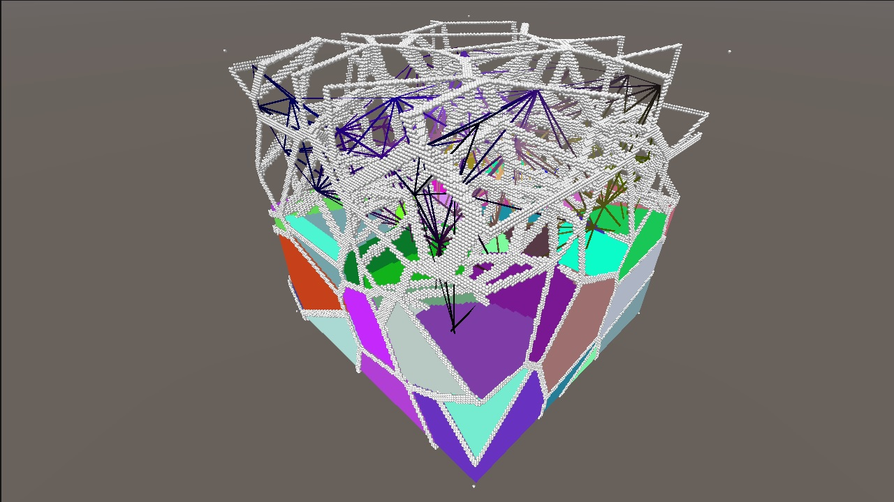

# Unity GPU Based Tetrahedralization

Author: Przemyslaw Zaworski
 
Licence: MIT https://mit-license.org/ (see LICENSE.md)

Special Thanks: Michel van de Gaer (http://800millionparticles.blogspot.com/)

Usage: 

* Download Unity 2022 from https://unity.com/releases/editor/archive

* File -> Open Project. Then open the scene MainScene. Play.

3D Delaunay Tetrahedralization of random input points in Unity. 

Voronoi Diagram is generated in real time with Jump Flooding Algorithm (HLSL compute shader).

Tetrahedralization kernel description:

* Read current voxel from Voronoi diagram, index to the closest seed (struct with position and color) is stored in alpha channel;

* Get all neighbors voxels to fixed array (neighbours = 26 elements in total);

* Count distinct voxels in an array, add their indexes to another array;

* If we found a contact point between four Voronoi cells (count == 4), we can generate new tetrahedron (create four triangles from the closest four seeds, append them to HLSL AppendStructuredBuffer).

To Do:

* Visualising Voronoi edges as lines (see third image). Currently they are rendered as independent, unsorted points. For 2D version, it is possible to sort edges by angle with: "float GetAngleFromCoordinates (float2 p) { return atan2(p.y, p.x) * 360.0 / (3.14159266 * 2.0);} float angle = GetAngleFromCoordinates(fragCoord - _Seeds[index].Location);". How to do it for 3D ?

* Real time mesh clean up (delete reduntant triangles).